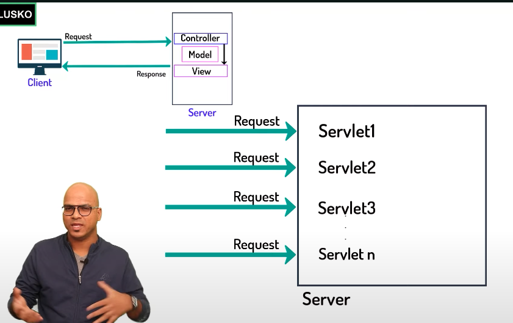
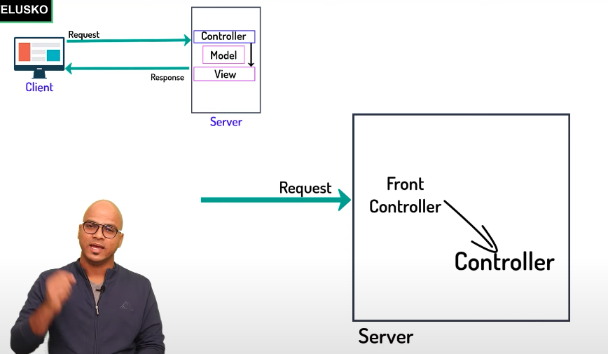
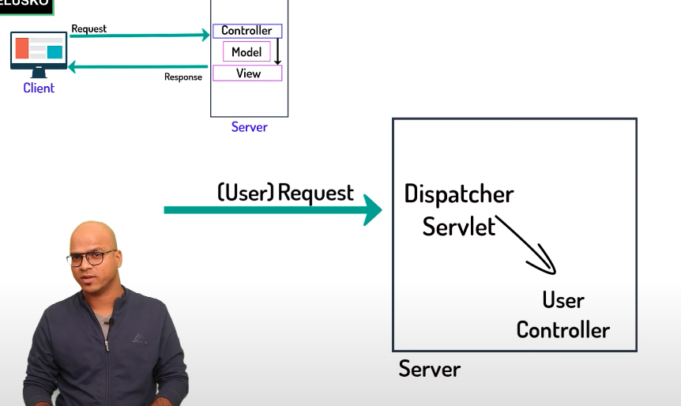

# Spring MVC.

1.  There are two ways of creating Spring MVC project.

    - Spring MVC Configuration (Lots of Configuration)
    - Spring Boot (Made things easier less config.)

2.  What is a Servlet ?

    - A servlet is a Java programming language class that is used to extend the capabilities of servers that host applications accessed by means of a request-response programming model.

    **Explanation**

    - Whenever the Client sends the request to the Server, It is Servers responsibility to process the request and give it back to the client.

    

    - Servlet will create the data and Layout which client requires from the response.
    - We need three things:

      - To accept the client requests and send the response (Controller Earlier we used Servlets for Controllers.) (**C**)
      - To Hold the Data (Model) (Pojo Class) (**M**)
      - To view the Data (UI Design) (JSP) (**V**)

    - **We have some issues: What will happen if we have multiple Controllers ?**

      - We need to have multiple Servlet to handle.
      - Each Servlet will handle a single Controller. (**Single Action Controller**)

      

      - **We need a single Controller that would handle multiple requests.**
      - **We need some front controller, Based on the request, the front controller will check and send it to the actual controller.**

      

      - In Spring MVC, we do not need to create a front controller, Spring MVC will provide for us.

      - Front Controller (**Dispatch Servlet**) -> Dispatch Servlet is provided by Spring Framework.

      

      - How will Dispatch Servlet know that you need to call an user Controller, we need a file, in which there are configurations related to this mapping.

- Tomcat Jasper is required to convert the JSP (Jakarta Server Pages or Java Server Pages) to Servlet.

3. JDBC Connection?

   - In Java, Inorder to connect to the DBMS (Postgres SQL), we need to follow certain steps.

   1. Import packages. (Contains all the classes and interfaces for jdbc java.sql.\* -> package)
   2. Load Driver and Register Driver. (Driver will be provided by RDBMS (R - Relational))
   3. Establish the Connection.
   4. Create Connection
   5. Create Statement
   6. Execute Statement
   7. Close.

4. SpringBoot Project:

- Springboot provides both dependency and Basic configuration will be done by springBoot.
- production ready
- SpringBoot contains embedded tomcat server. Can run project in any JVM.

**Dependency Injection:**

- Design Pattern
- Loose Coupling prevents tight coupling.
- For testing it is easy.
- Code can be flexible and maintainable.

```java

class Laptop {
  @Autowired
  HardDrive obj1;
}

@Component
class HitachiHD implements HardDrive {
  ...
}
```

- In JVM, we have a spring container, the content present inside this container are called as Spring Beans.

- There are many scopes in spring out of which mainly there are two scopes:

  - singleton
  - prototype.

- Spring provides default singleton object scope for the bean. In singleton we get only one instance.
- If the scope provided is prototype, everytime, we create a bean, a new object is created.
